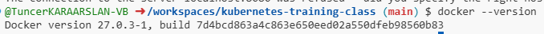

# Docker version check

Docker versiyonunu öğrenmek için terminalde veya komut satırında şu komutu kullanabilirsiniz:

```bash
docker --version
```

Bu komut, sistemde yüklü olan Docker'ın sürüm bilgilerini basit bir şekilde gösterir. Çıktı şu şekilde olabilir:

```
Docker version 20.10.8, build 3967b7d
```




```bash
docker version
```

Bu komut, Docker Engine ve Client hakkında daha kapsamlı bilgiler verir, örneğin:

```
Client:
 Version:           20.10.8
 API version:       1.41
 Go version:        go1.16.6
 Git commit:        3967b7d
 Built:             Fri Jul 30 19:54:15 2021
 OS/Arch:           linux/amd64
 Context:           default
 Experimental:      true

Server:
 Engine:
  Version:          20.10.8
  API version:      1.41 (minimum version 1.12)
  Go version:       go1.16.6
  Git commit:       75249d8
  Built:            Fri Jul 30 19:52:40 2021
  OS/Arch:          linux/amd64
  Experimental:     false
```
