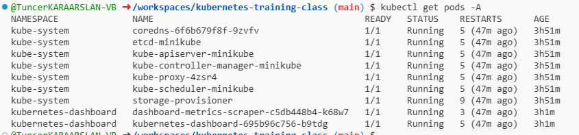
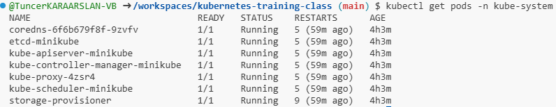
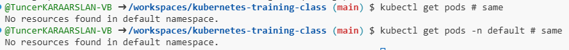
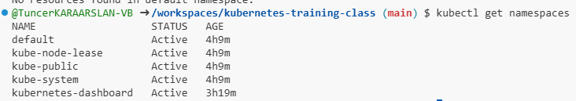
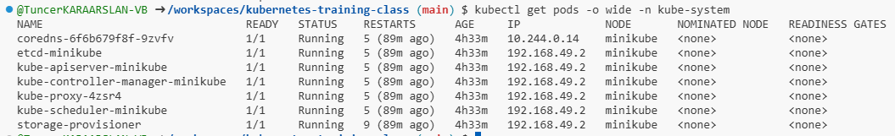
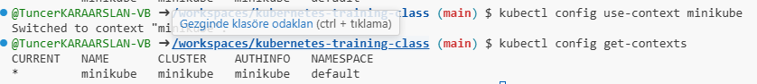

# Kubectl get pods

podların tüm napespacelerdeki listesini getirir.
Aşağıdaki iki kodda aynı sonuçları çıkardı.

```
kubectl get pods -A # same
kubectl get pods --all-namespaces # same
```



---

bir namespace içerisindeki podların listesini getirir.

```
kubectl get pods -n kube-system
```



---

Eğer namespace bildirilmez ise, aktif namespace (şu an default) içerisindeki podların stesi gelir. Aşağıdaki komut gibi explicit bildirim ile default namespace bildirilerek de komut çalıştırılabilir.

' # same ile komut satırına commment ekledik.

```
kubectl get pods # same
kubectl get pods -n default # same
```



---

Kubertenes ortamındaki namespace'ler listenelir.

```
kubectl get namespaces
```



---

Tüm poıdları detayları ile listeler

```
kubectl get pods -o wide
```



---

```
kubectl get context
```


```
kubectl get config get-contexts
```

---

Aktif context değiştirilir.

```
kubectl config use-context minikube
```

