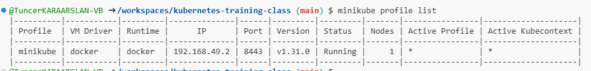
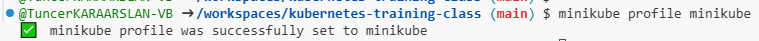

# Minikube start

## Steps to Install Minikube

1. **Update and Upgrade the System**:
   Before proceeding, it's good practice to update the package lists and upgrade installed packages:

   ```bash
   sudo apt update && sudo apt upgrade -y
   ```

2. **Start Minikube with Docker Driver**:
   
   To start Minikube using Docker as the driver, run the following command:
   
   ```bash
   minikube start --driver=docker
   ```

3. **Check Minikube Status**:
   
   Verify that Minikube is running correctly:
   
   ```bash
   minikube status
   ```

4. **Access the Minikube Dashboard (Optional)**:
   
   Minikube provides a dashboard for visual management. To launch it, run:
   
   ```bash
   minikube dashboard
   ```

5. **Using kubectl with Minikube**:
   
   You can now use `kubectl` to manage your Minikube cluster. For example, check the nodes in your cluster with:
   
   ```bash
   kubectl get nodes
   ```

6. **Minikube profile**:
   
   You can now use `kubectl` to manage your Minikube cluster. For example, check the nodes in your cluster with:
   
   ```bash
   kubectl profile list
   ```   

   

   ***minikube***

      ```bash
   kubectl profile minikube
   ```



   Öncelikle profil listesi alınır. Ardından listedeki durumu öğrenilmek istenen profil ismi ile yeniden 2. komut çalıştırılır.
   